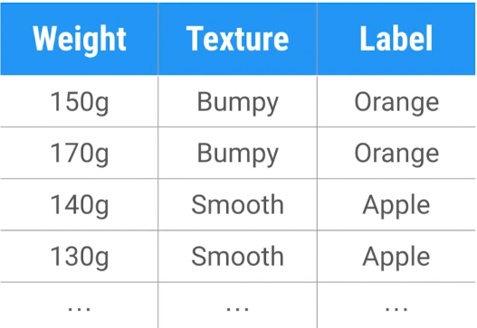

<h1 align="center">Hello World | Olá Mundo</h1>

EN: In this video you can understand the concept of Machine Learning. The study of algorithms that learn from examples and experiences, instead of relying on pure code. We will write a code capable of differentiating apples and oranges.

PT-BR: Neste vídeo pode-se entender o conceito de Machine Learning. O estudo de algoritmos que aprendo com exemplos e experiências, ao invês de depender de código puro. Escreveremos um codígo capaz de diferenciar maçãs e laranjas.

<a target="_blank" href="./video_01.py">Código | Code</a>

<h2>Concepts | Conceitos</h2>
<ul>
    <li>Classifier | Classificador:  
    EN: Uses data as input and assigns a marker. 
    PT-BR: Utiliza de dados como entrada e atribui um marcador.</li>
     
    <li>Supervised Learning | Aprendizado Supervisionado:  
    EN: Creates a classifier by finding patterns in the examples (training data). 
    PT-BR: Cria um classificador encontrando padrões nos exemplos(dados de treino).</li>
     
    <li>Features:  
    EN: Creates a classifier by finding patterns in the examples (training data). 
    PT-BR: Característica mensurável individual de um fenômeno que está sendo observado.</li>
     
    <li>Label | Marcador:  
    EN: What we're predicting.
    PT-BR: O que estamos prevendo.</li>
</ul>

<h2>Installing Anaconda | Instalando Anaconda</h2> 
<a target="_blank" href="https://www.anaconda.com/distribution/">Download Page</a>

<h2>Passos do Aprendizado Supervisionado | Supervised Learning Steps</h2>
<ol>
    <li>Collect Training Data | Coletar Dados de Treino:  
    EN: In this case, we will collect data from apples and oranges, such as weight and texture. 
    PT-BR: Neste caso iremos coletar dados das maçãs e maranjas como peso e textura.</li>
     
    <li>Train Classifier | Treinar o Classificador</li>
     
    <li>Make Predictions | Fazer Predições</li>
</ol>

<h2>Training Data | Dados de Treinamento</h2>
EN: In the video we use a table with the weight of each fruit, the texture and we know its marker, with this we will use this data to create a classifier capable of predicting whether it is an apple or orange using two features: weight and texture. Note that in the code we take 0 for irregular texture and 1 for regular, as well as 0 for apple and 1 for orange. 
PT-BR: No vídeo usamos uma tabela com o peso de cada fruta, a textura e sabemos qual seu marcador, com isto usaremos estes dados para criar um classificador capaz de prever se é uma maçã ou laranja utilizando duas features: peso e textura. Nota-se que no código tomamos 0 para textura irregular e 1 para regular, assim também como usa-se 0 para maçã e 1 para laranja. 

<h2>Classifier | Classificador </h2>
PT-BR: Usaremos a <a target="_blank" href="https://scikit-learn.org/stable/modules/generated/sklearn.tree.DecisionTreeClassifier.html">Árvore de Decisão</a> como classificador. 
EN: We will use the <a target="_blank" href="https://scikit-learn.org/stable/modules/generated/sklearn.tree.DecisionTreeClassifier.html"> Decision Tree </a> as a classifier.
