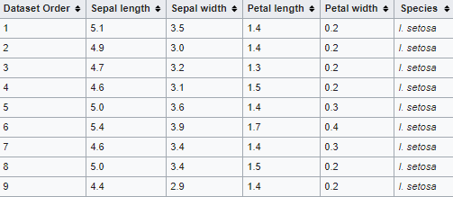
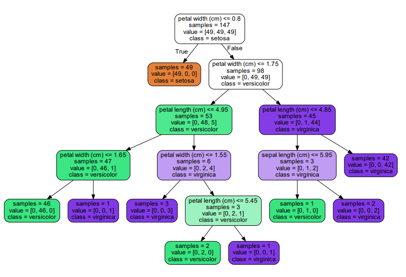

<h1>Visualizing a Decision Tree | Visualizando uma Árvore de Decisão</h1>

EN: 

PT-BR: Anteriormente, usamos a Árvore de Decisão como classificador, agora iremos adicionar códigos para ver como funciona por trás dos panos. Iremos utilizar o <a href="https://en.wikipedia.org/wiki/Iris_flower_data_set">Iris flower data set</a> como nosso conjunto de dados.

<a target="_blank" href="./video_02.py">Código | Code</a>

<h2>Summary | Sumário</h2>

Concepts | Conceitos

<ul>
    <li>Dataset | Conjunto de dados:  
    EN: A collection of normally tabulated data. For each element there are several characteristics. Each column represents a specific variable. Each row corresponds to a specific member of the data set in question. Each value is known as a die. 
    PT-BR: Uma coleção de dados normalmente tabulados. Por cada elemento se indicam várias características. Cada coluna representa uma variável particular. Cada linha corresponde a um determinado membro do conjunto de dados em questão. Cada valor é conhecido como um dado.</li>
     
    <li>Testing Data | Dados de Teste:  
    EN: Examples used to "test" the classifier's accuracy. Not part of the training data. 
    PT-BR: Exemplos usados para "testar" a precisão do classificador. Não faz parte dos dados de treinamento.</li>
</ul>

<h2>Goals | Objetivos</h2>
<ol>
    <li>Import dataset | Importar o conjunto de dados:  
    EN: In this case, we will import the dataset direct from the scikit. 
    PT-BR: Nesse caso, importaremos o conjunto de dados diretamente do scikit.</li>
     
    <li>Train Classifier | Treinar o Classificador
    EN: In this case we will use petal length, petal width, sepal length, sepal width to classify the species. 
    PT-BR: Neste caso, usaremos comprimento da pétala, largura da pétala, comprimento da sépala, largura da sépala para classificar a espécie.  
    </li>
     
    <li>Make Predictions | Fazer Predições
    EN: We will predict the test data, given that we already know their classification. 
    PT-BR: Iremos prever os dados de teste, tendo em vista que já sabemos a classificação deles.</li>
     
    <li>Visualize the tree | Visualizar a Árvore de decisão
    
    EN: Each node asks yes or no about each of the features, if it is true it goes to the left, otherwise it goes to the right. 
    PT-BR: Cada nódulo pergunta sim ou não sobre cada uma das características, se é verdade ele vai para esquerda caso contrário irá para direita.</li>
</ol>