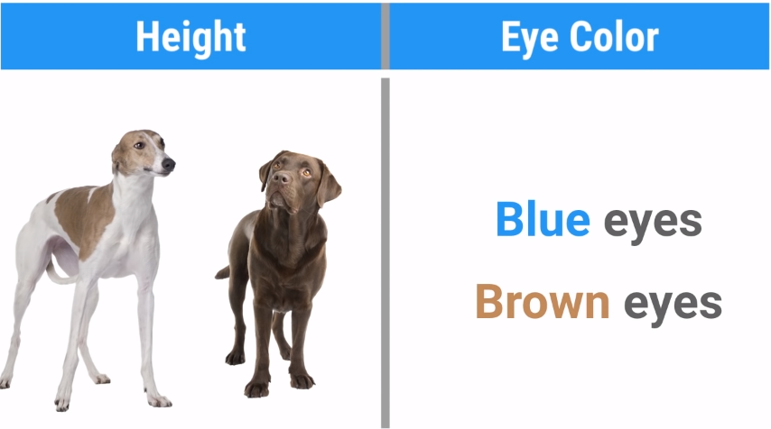
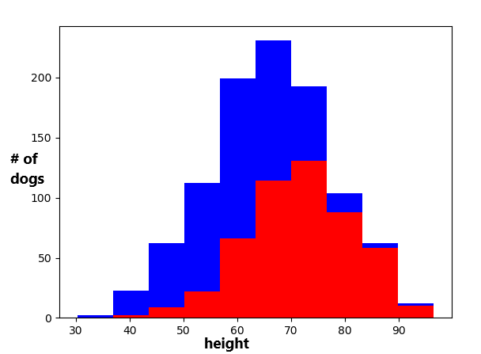

<h1 align="center">What Makes a Good Feature? | O que determina uma boa característica?</h1>

EN: Earlier we saw the concept of features, but what determines its quality? In this example we will see what is the best feature to differentiate two types of dog: English Greyhound and Labradors.

PT-BR: Anteriormente vimos o conceito de features, mas o que determina sua qualidade? Neste exemplo iremos ver qual a melhor característica para diferenciar dois tipos de cachorro: Galgo Inglês e Labradores.

<a target="_blank" href="./video_03.py">Código | Code</a>

<a target="_blank" href="https://www.youtube.com/watch?v=N9fDIAflCMY">YouTube Link</a>

<h2>Suppositions | Suposições</h2>
<ol>
    <li>Height | Altura:  
    EN: Let's consider that: Greyhounds are taller than Labradors. 
    PT-BR: Vamos considerar o seguinte: os galgos são mais altos que os labradores.</li>
     
    <li>Eye Colors | Coloração dos Olhos: 
    EN: Then let's pretend that dogs only have two eye colors: blue and brown. And that it does not depend on the breed of the dog, based on that, we only have one useful feature 
    PT-BR: Depois vamos fingir que os cachorros só tem duas colorações de olho: azul e marrom. E que ela não depende da raça do cachorro, baseado nisso, só possuímos uma característica útil 
    </li>
     
    <li>Understanding the reason for this | Entendendo o motivo disto. 
    EN: In this example, greyhounds are on average 71 cm tall, Labradors are 61 cm tall. And the margin of error for both will be 10 cm. We can visualize in a histogram: 
    PT-BR: Neste exemplo os galgos tem em média 71 cm de altura, já os labradores 61 cm. E a margem de erro de ambos será de 10 cm. Podemos visualizar em um histograma: 
     
    EN: On the left the probability of being a Labrador is high, on the right the probability of being an English Greyhound is higher. But what about a dog in the middle? With that we saw that height is a useful feature, but not perfect. 
    PT-BR: Na esquerda a probabilidade de ser um labrador é alta, já na direita a probabilidade de ser um Galgo Inglês é maior. Mas e um cachorro no meio? Com isso vimos que altura é uma característica útil, mas não perfeita.
    </li>
</ol>