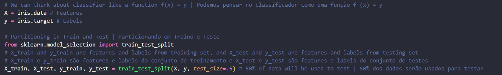

<h1 align="center">Let's Write a Pipeline | Vamos Escrever uma Pipeline</h1>

EN: In this exercise we will write a basic pipeline for supervised learning, then we will understand how several different classifiers can solve the same problem.

PT-BR: Neste exercício vamos escrever um pipeline básico para aprendizado supervisionado, depois vamos entender como vários classificadores diferentes podem resolver o mesmo problema.

<a target="_blank" href="./video_04.py">Código | Code</a>

<a target="_blank" href="https://www.youtube.com/watch?v=84gqSbLcBFE">YouTube Link</a>

<h2>Concepts | Conceitos</h2>
<ul>
    <li>Model | Modelo:  
    EN: Refers to the model artifact that is created by the training process. 
    PT-BR: Refere-se ao artefato do modelo criado pelo processo de treinamento.</li>
    
</ul>

<h2>Initial Concept | Conceito Inicial</h2>
<ol>
    <li>Train Data | Dados de Treino 
    EN: Imagine building a spam classifier. Suppose you have already collected the data and trained a model. 
    PT-BR: Imagine estar construindo um classificador de spam. Suponha que já tenha coletado os dados e treinado um modelo. 
    
    </li>
     
    <li>Test Data | Dados de Teste 
    EN: How accurate will it be in relation to data that was not in the test data? 
    PT-BR: Quão preciso ele será em relação a dados que não estavam no conjunto de testes? 
    </li>
     
    <li>Partitioning | Particionamento 
    EN: We will divide our data as follows: the first half will be for training the classifier, and the second half for the test. 
    PT-BR: Iremos dividir nossos dados da seguinte maneira: a primeira metade será para treino do classificador, e a segunda metade para o teste. 
     
    EN: Knowing this, we will have test features and test labels, as well as training features and training labels. 
    PT-BR: Sabendo disso teremos features de teste e labels de teste, assim como teremos features de treino e labels de treino.
    </li>
</ol>

<h2>Classifier Function | Função do Classificador</h2>
<ul>
    <li> 
    EN: Pretend that we want to distinguish the green dots from the red ones. We will then have two features, the x and y coordinates of each dot. 
    PT-BR: Faça de conta que queremos distinguir os pontos verdes dos vermelhos. Teremos então duas features, as coordenadas x e y de cada ponto.
    </li>
    <li> 
    EN: We want a function that classifies a point that has never been seen before, and classifies it as red or green. 
    PT-BR: Queremos uma função que classifique um ponto nunca visto antes, e classifique-o como como vermelho ou verde.
    </li>
    <li> 
    EN: Based on the points that already existed, we can see that we can draw a line that separates both, this can be used as a classifier. 
    PT-BR: Baseado nos pontos que já existiam, podemos ver que podemos traçar uma linha que separe ambos, esta pode ser usada como classificador.
    </li><li> 
    EN: Knowing that the line equation can be described as y = mx + b, we can analyze point by point and adjust its parameters. One way of thinking about learning is to use training data to adjust the parameters of a model. 
    PT-BR: Sabendo que a equação da linha pode ser descrita como y = mx + b, podemos analisar ponto por ponto e ir ajustando seus paramêtros. Um modo de pensar no aprendizado é usando dados de treinamento para ajustar os paramêtros de um modelo.
    </li>
</ul>