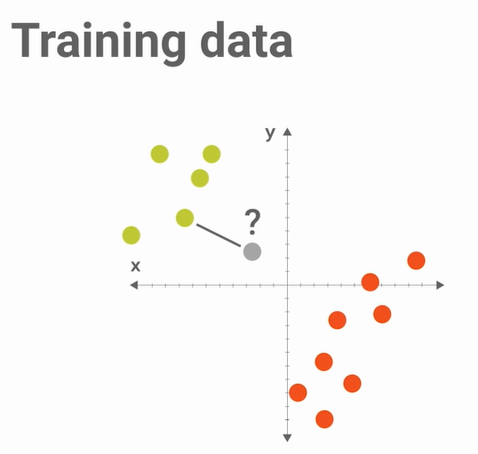
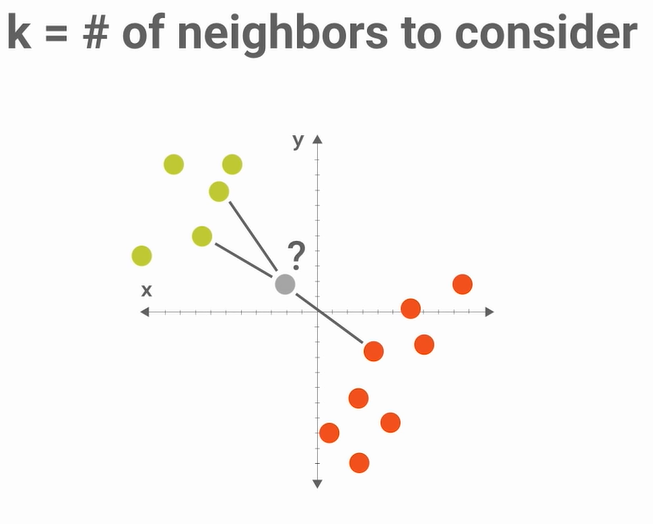
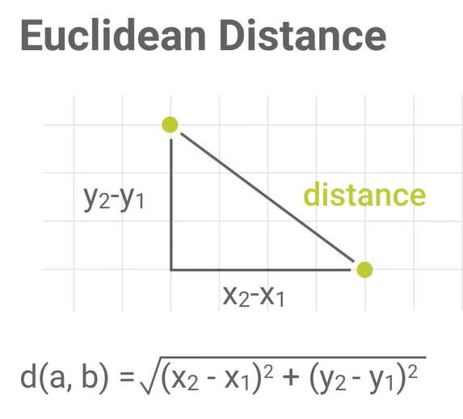

<h1 align="center">Writing Our First Classifier | Escrevendo o nosso primeiro Classificador</h1>

EN: Now, we will write our classifier from the beginning, this will be an incomplete version of k-Nearest Neighbors.

PT-BR: Agora, iremos escrever nosso classificador do ínicio, este será uma versão incompleta do k-Nearest Neighbors.

<a target="_blank" href="./video_05.py">Código | Code</a>

<a target="_blank" href="https://www.youtube.com/watch?v=AoeEHqVSNOw">YouTube Link</a>

<h2>Outline | Esboço:</h2>
<ul>
    <li>EN: Let's start with the code for Episode 4: <a href="../video_04/video_04.py"> "Let's write a Pipeline" </a>. Keep in mind that in that episode we did a simple experiment, we divided the data set into training and testing. We use training data to train a classifier, and test data to assess its accuracy. Now we will focus on writing the classifier.</li> 
    <li>PT-BR: Vamos começar com o código do Episódio 4: <a href="../video_04/video_04.py">"Vamos escrever uma Pipeline"</a>. Tenha em mente que naquele episódio fizemos um experimento simples, dividimos o conjunto de dados em treino e teste. Usamos os dados de treino para treinar um classificador, e os dados de teste para avaliar a sua precisão. Agora iremos focar em escrever o classificador.</li>
</ul>

<h2>Steps | Passos</h2>
<ul>
    <li>Step 1 | Passo 1 
    EN: Remove old classifiers. (Note that we previously had 2 classifiers to relate their accuracy, in this episode we’ll only have one.) 
    PT-BR: Remover os classificadores antigos. (Note que anteriormente tinhamos 2 classificadores para relacionar a precisão deles, neste episódio teremos só um.)</li>
    <li>Step 2 | Passo 2 
    EN: Implement a class to our classifier, we will call it ScrappyKNN and use it as a classifier. 
    PT-BR: Implementar uma classe ao nosso classificador, chamaremos de ScrappyKNN e usaremos como classificador.</li>
    <li>Step 3 | Passo 3 
    EN: We will see what methods we need to implement. We will have to create the fit method, which does the training, and the predict method, which makes the forecast. 
    PT-BR: Iremos ver quais métodos precisamos implementar. Teremos que criar o método fit, que faz o treinamento, e o predict, que faz a previsão.</li>
    <li>Step 4 | Passo 4 
    EN: Make the pipeline work and understand what the methods do. We will write a random classifier. Accuracy should be around 33%, because we have 3 possibilities of flowers. 
    PT-BR: Fazer o pipeline funcionar e entender o que os métodos fazem. Iremos escrever um classificador aleatório. A precisão deve ser por volta de 33%, por conta de termos 3 possibilidades de flores. 
    <pre><code>class ScrappyKNN():
    def fit(self, X_train, y_train): # (Step 3)
        self.X_train = X_train
        self.y_train = y_train
    def predict(self, X_test, y_test): # (Step 3)
        predictions = []
        for row in X_test:
            label = random.choice(self.y_train)
            predictions.append(label)
        return predictions</code></pre></li>
    <li>Step 5 | Passo 5 
    <h3>EN: Intro to k-NN(K-Nearest Neighbors):</h3> 
    We will implement the algorithm so that we have a test point on the graph and we have to classify it as green or red. Our classifier will work with the nearest point, in this case, green. 
    <h3>PT-BR:Introdução ao k-NN(K-ésimo Vizinho mais Próximo):</h3> 
    Iremos implementar o algoritmo de maneira que tenhamos um ponto de teste no gráfico e tenhamos que classificar como verde ou vermelho. O nosso classificador ira trabalhar com o ponto mais próximo, neste caso, verde. 
     
    <h3>EN: Equidistants Points: </h3> 
    Suppose we have a point whose distance from the nearest point is the same distance from another point of different classification. In this case we will find another point nearby, and classify it based on k points. In this case, the classification will be green because the second closest point is green.  
    <h3>PT-BR: Pontos Equidistantes:</h3> 
    Suponhamos que tenhamos um ponto cuja distância com o ponto mais proxímo seja a mesma distância de outro ponto de classificação diferente. Neste caso iremos achar outro ponto próximo, e classificar baseado em k pontos. Neste caso a classificação será verde pois o segundo ponto mais próximo é verde. 
    
    </li>
    <li>Step 6 | Passo 6 
    EN: To write the code we need a way to measure the distance between the points, that is, find the nearest neighbor. We will measure a straight line, between two points as we do with a ruler. Note that there is a formula for this called Euclidean Distance, it measures the distance of two points and works a little like the Pythagorean theorem: a² = b² + c². It is nice to note that because we are only computing a two-dimensional space because we only have 2 features (x, y), if there was one more feature, we would then be in a cube (three-dimensional space), already with four elements as in <a href="https://en.wikipedia.org/wiki/Iris_flower_data_set"> Iris </a> we would be in a hypercube and it is not so simple to visualize it, however Euclidean Distance works in the same independent way of the number of dimensions. 
    PT-BR: Para escrever o código precisamos de uma forma de medir a distância entre os pontos, ou seja, achar o vizinho mais próximo. Iremos medir uma linha reta, entre dois pontos como fazemos com uma régua. Nota-se que existe uma fórmula para isso chamada de Distância Euclidiana, ela mede a distância de dois pontos e funciona um pouco como o teorema de Pitágoras: a² = b² + c². É bacana notar, que por termos somente que estamos computando um espaço bi-dimensional pelo fato de termos apenas 2 features(x, y), caso houvesse mais uma feature, estaríamos então em um cubo(espaço tri-dimensional), já com quatro elementos como na <a href="https://en.wikipedia.org/wiki/Iris_flower_data_set">Iris</a> estaríamos em um hipercubo e não é tão simples visualizá-lo, porém a Distância Euclidiana funciona da mesma maneira independente do número de dimensões.  
    
    <h3>Code of Euclidean Distance | Código da Distância Euclidiana</h3>
    <pre><code>from scipy.spatial import distance 
    def euc(a, b):
        return distance.euclidean(a, b)
    </pre></code>
    </li>
    <li>Step 7 | Passo 7 
    Implementing the classifier | Implementando o classifier: 
    
<a target="_blank" href="./video_05.py"> Code Done | Código Pronto</a>

    </li>
    <li>Step 8 | Passo 8 
    EN: Running the pipeline, we will can see an accuracy of more 90%. That's can say our classifier is nice for this problem. 
    PT-BR: Ao executar o pipeline, veremos uma precisão de mais de 90%. Isso pode dizer que nosso classificador é bom para esse problema.</li>
</ul>
